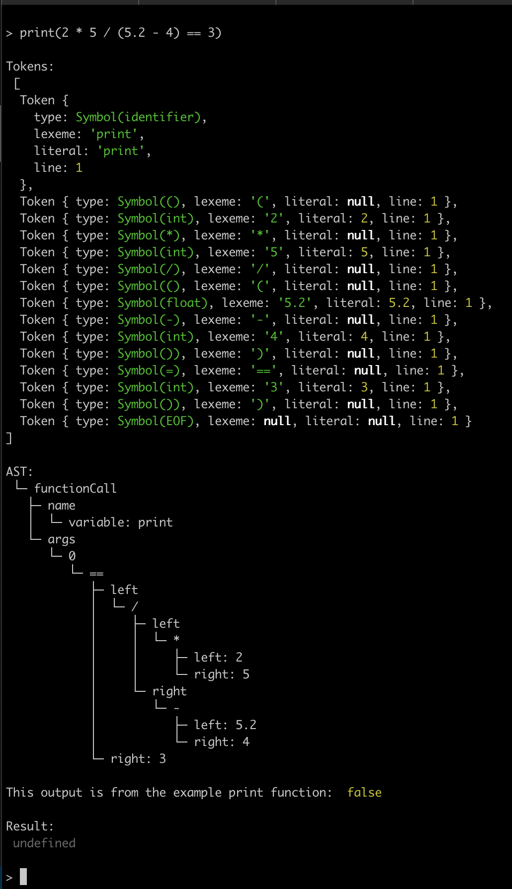

# Liferay Forms Evaluator in JavaScript

## Installation

```bash
yarn
```

## Running

To run the REPL, run:

```bash
yarn start
```

Now you can start evaluating expressions. For every line you type in the interpreter will evaluate it and print out the tokens list, AST and finally evaluate the expression and display the result.

If we try out the following expression:

```javascript
print(2 * 5 / (5.2 - 4) == 3)
```

The interpreter should output:



Try it out!